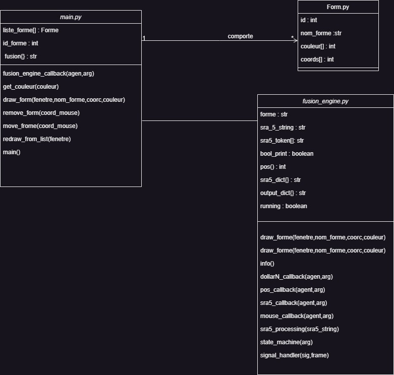
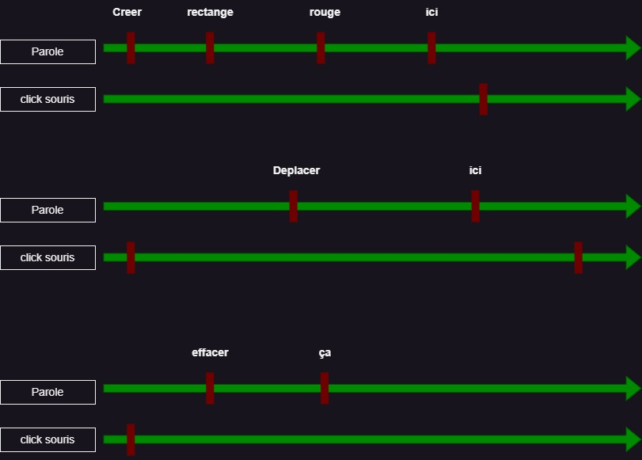
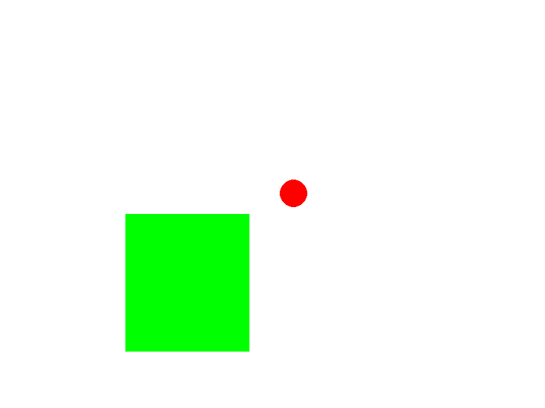
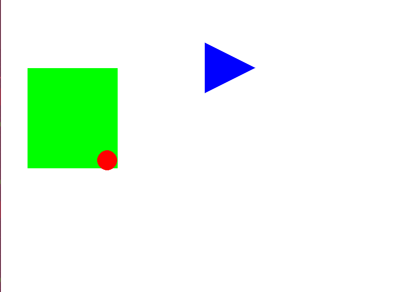
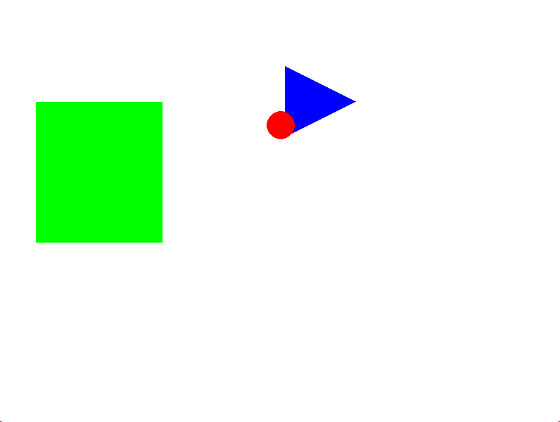

# Projet Interaction multimodale
### Auteurs : Nelson Sanchez , Arnaud Grondin , Elio Genson 

## Introduction
Dans le cadre du cours d'interaction Homme-Machine il nous a été demandé de réaliser un projet d'interaction multimodale 
permettant à l'utilisateur de dessiner, déplacer ou de supprimer certaines formes en utilisant à la fois sa voix et sa souris

## Architecture de l'application 
Diagramme de classe de l'application :

On lance en parallèle une exécution du fichier main.py pour l'affichage et les clics souris, de sra5 pour la commande audio, et de fusion_engine.py pour gérer les messages
sur le bus de communications ivy.

## Aspects temporel
Notre application fonctionne selon les chronogrammes suivant: 

L'utilisateur  dit d'abord à l'oral quelle forme il souhaite dessiner/déplacer/effacer en précisant la couleur puis il clique sur l'endroit voulu

### captures d'écran
Voici quelques captures d'écran illustrant le fonctionnement de l'application

Creation d'une forme :

Déplacement d'une forme (ici le cercle rouge) : 

